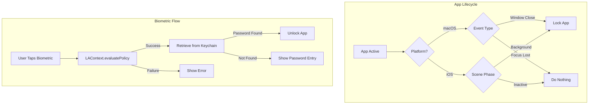

# Bug Fix Plan: Locking Behavior & Biometric Unlock

## Overview

Two bugs need to be fixed:
1. App locks on focus lost instead of only on window close
2. Biometric unlock does not work

---

## Bug 1: Locking on Focus Lost

### Current Behavior

In [`ExoCortexApp.swift`](../ExoCortex/ExoCortexApp.swift), the app locks in three scenarios:

```swift
// Line 26-31: scenePhase change handler
.onChange(of: scenePhase) { _, newPhase in
    if newPhase != .active {
        viewModel.lock()
    }
}

// Line 33-39: Window close handler (macOS) - CORRECT
.onReceive(NotificationCenter.default.publisher(for: NSWindow.willCloseNotification)) { ... }

// Line 40-43: App resign active handler (macOS) - PROBLEMATIC
.onReceive(NotificationCenter.default.publisher(for: NSApplication.willResignActiveNotification)) { _ in
    viewModel.lock()
}
```

### Platform Considerations

#### macOS
- **Possible**: Yes, macOS supports detecting window close vs focus change
- **Solution**: Remove `willResignActiveNotification` handler, keep only `willCloseNotification`
- Users can switch between apps without losing their work

#### iOS
- **Different behavior**: iOS apps dont have traditional windows
- `scenePhase` states:
  - `.active` - App is in foreground and receiving events
  - `.inactive` - App is visible but not receiving events (e.g., during notifications panel)
  - `.background` - App is not visible
- **Solution**: Only lock on `.background`, not `.inactive`
- This prevents locking when pulling down notification center or control center

### Proposed Fix

```swift
// ExoCortexApp.swift

@main
struct ExoCortexApp: App {
    @StateObject private var viewModel = LogViewModel()
    @Environment(\.scenePhase) private var scenePhase

    var body: some Scene {
        WindowGroup {
            ContentView()
                .environmentObject(viewModel)
                #if os(iOS)
                .onChange(of: scenePhase) { _, newPhase in
                    // iOS: Only lock when app goes to background (not just inactive)
                    if newPhase == .background {
                        viewModel.lock()
                    }
                }
                #endif
                #if os(macOS)
                .onReceive(NotificationCenter.default.publisher(for: NSWindow.willCloseNotification)) { notification in
                    // macOS: Only lock when window closes
                    if notification.object is NSWindow {
                        viewModel.lock()
                    }
                }
                // REMOVED: willResignActiveNotification handler
                #endif
        }
        // ... rest of Window configuration
    }
}
```

---

## Bug 2: Biometric Unlock Not Working

### Current Implementation Issues

In [`KeychainService.swift`](../ExoCortex/KeychainService.swift):

1. **Synchronous execution on MainActor**: Biometric authentication must present a UI and wait for user input. The current synchronous `SecItemCopyMatching` call may fail because the biometric prompt needs to be async.

2. **Missing `kSecUseOperationPrompt`**: While `context.localizedReason` is set, the keychain query should include `kSecUseOperationPrompt` for the biometric dialog.

3. **LAContext pre-evaluation may block**: Calling `canEvaluatePolicy` creates the biometric context but doesnt trigger the actual authentication.

### Root Cause Analysis

The current code flow:

```swift
func loadPasswordWithBiometrics(reason: String) throws -> String {
    let context = LAContext()
    
    // This checks if biometrics are available but doesn't authenticate
    guard context.canEvaluatePolicy(.deviceOwnerAuthenticationWithBiometrics, error: &authError) else {
        throw KeychainServiceError.biometryUnavailable
    }
    
    context.localizedReason = reason
    
    // This synchronous call attempts to trigger biometrics via keychain
    // BUT: On @MainActor, this can cause issues
    let status = SecItemCopyMatching(query as CFDictionary, &item)
}
```

The issue is that `SecItemCopyMatching` with biometric protection is expected to trigger the biometric prompt, but:
- The method is marked `throws` (synchronous) but biometrics need async handling
- Being on `@MainActor` with a synchronous call can cause UI blocking

### Proposed Fix

Convert to async operation with explicit LAContext evaluation:

```swift
/// Load password from keychain using biometric authentication
/// - Parameter reason: Reason string shown to user during biometric prompt
/// - Returns: The stored password
func loadPasswordWithBiometrics(reason: String) async throws -> String {
    let context = LAContext()
    context.localizedReason = reason
    
    // Check if biometrics are available
    var authError: NSError?
    guard context.canEvaluatePolicy(.deviceOwnerAuthenticationWithBiometrics, error: &authError) else {
        throw KeychainServiceError.biometryUnavailable
    }
    
    // First, authenticate with LAContext explicitly
    do {
        let success = try await context.evaluatePolicy(
            .deviceOwnerAuthenticationWithBiometrics,
            localizedReason: reason
        )
        guard success else {
            throw KeychainServiceError.biometryUnavailable
        }
    } catch {
        throw KeychainServiceError.biometryUnavailable
    }
    
    // Now retrieve from keychain using the authenticated context
    let query: [String: Any] = [
        kSecClass as String: kSecClassGenericPassword,
        kSecAttrService as String: service,
        kSecAttrAccount as String: account,
        kSecReturnData as String: true,
        kSecUseAuthenticationContext as String: context
    ]
    
    var item: CFTypeRef?
    let status = SecItemCopyMatching(query as CFDictionary, &item)
    
    guard status != errSecItemNotFound else {
        throw KeychainServiceError.itemNotFound
    }
    
    guard status == errSecSuccess,
          let data = item as? Data,
          let password = String(data: data, encoding: .utf8) else {
        throw KeychainServiceError.unexpectedStatus(status)
    }
    
    return password
}
```

### Update LogViewModel

In [`LogViewModel.swift`](../ExoCortex/LogViewModel.swift), update the caller:

```swift
func unlockWithBiometrics() {
    Task {
        do {
            let retrieved = try await keychain.loadPasswordWithBiometrics(reason: "Unlock ExoCortex")
            await unlock(using: retrieved)
        } catch {
            unlockError = "Biometric unlock failed: \(error.localizedDescription)"
        }
    }
}
```

Note: The call is already wrapped in a Task, so adding `await` is straightforward.

---

## Implementation Checklist

- [ ] **ExoCortexApp.swift**
  - [ ] Remove iOS `scenePhase` handler that locks on non-active
  - [ ] Add iOS-specific handler that only locks on `.background`
  - [ ] Remove macOS `willResignActiveNotification` handler
  - [ ] Keep macOS `willCloseNotification` handler

- [ ] **KeychainService.swift**
  - [ ] Convert `loadPasswordWithBiometrics` to async function
  - [ ] Add explicit `LAContext.evaluatePolicy` call before keychain access
  - [ ] Update error messages for clarity

- [ ] **LogViewModel.swift**
  - [ ] Update `unlockWithBiometrics` call to use await
  - [ ] Improve error message display

---

## Testing Plan

### macOS Testing
1. Open app and unlock
2. Switch to another app (Cmd+Tab) - should NOT lock
3. Return to app - should still be unlocked
4. Close window - should lock
5. Re-open window - should show lock screen
6. Test biometric unlock (Touch ID on MacBook Pro, etc.)

### iOS Testing
1. Open app and unlock
2. Pull down notification center - should NOT lock
3. Pull up control center - should NOT lock
4. Press home button or swipe up to go to background - SHOULD lock
5. Return to app - should show lock screen
6. Test Face ID / Touch ID unlock

---

## Architecture Diagram



---

## Risk Assessment

| Risk | Impact | Mitigation |
|------|--------|------------|
| Biometric fails silently | User frustrated | Improved error messages |
| Window close not detected | Data stays unlocked | Test thoroughly |
| iOS background detection delayed | Brief security gap | Acceptable trade-off for UX |
