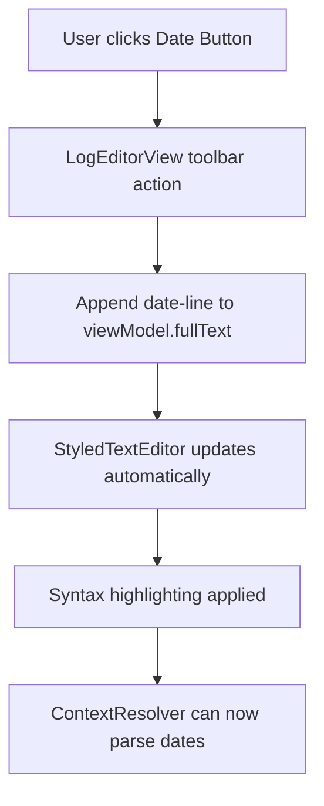
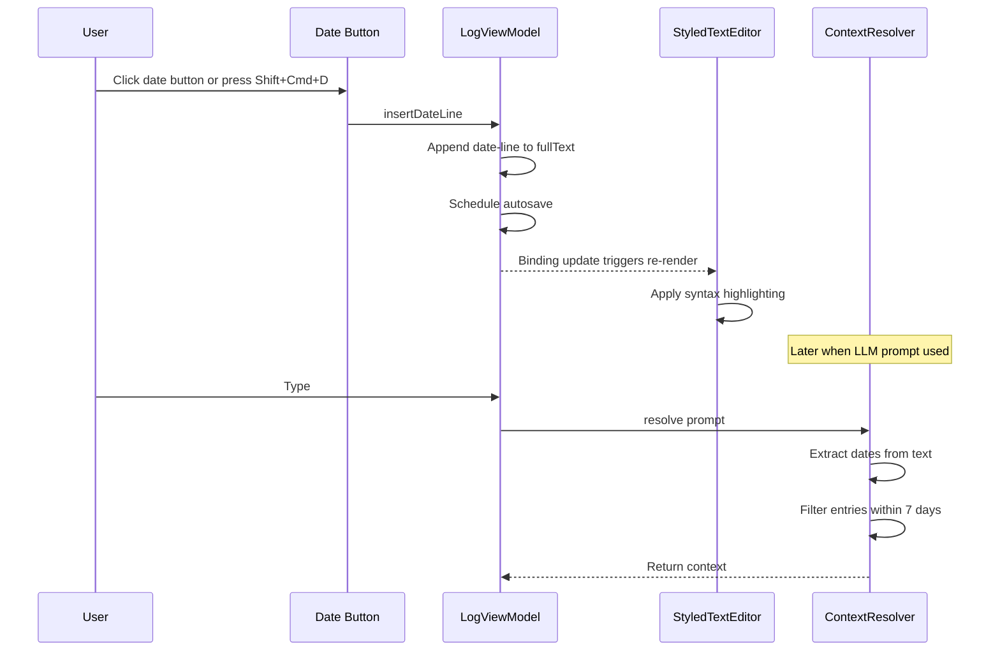

# Date-Line Button Feature Plan

## Overview

Add a button in the top toolbar (next to the search loupe button) that appends a date-line separator in ISO format: `--- 2026-01-01 ---`. This provides temporal context for the LLM to understand time-based queries like "the last week" (max 7 days back).

## User Requirements

- **Button Location**: Next to the search (magnifying glass) button in the toolbar
- **Date Format**: ISO format with dashes: `--- YYYY-MM-DD ---`
- **Insertion Behavior**: Append at the end of the log with newlines
- **Purpose**: Help LLM understand temporal context in the log

## Architecture (Simplified)



## Implementation Details

### 1. LogViewModel Modification

**File**: `ExoCortex/LogViewModel.swift`

Add a simple method to append the date-line:

```swift
/// Insert a date separator line at the end of the log
func insertDateLine() {
    let formatter = DateFormatter()
    formatter.dateFormat = "yyyy-MM-dd"
    let dateString = formatter.string(from: Date())
    let dateLine = "\n--- \(dateString) ---\n"
    fullText += dateLine
}
```

### 2. LogEditorView Modifications

**File**: `ExoCortex/ContentView.swift`

Add the date-line button to the toolbar (next to existing search button):

```swift
// In the toolbar section of LogEditorView, add before search button:
ToolbarItem(placement: .primaryAction) {
    Button {
        viewModel.insertDateLine()
    } label: {
        Image(systemName: "calendar.badge.plus")
    }
    .help("Insert date separator")
    .keyboardShortcut("d", modifiers: [.command, .shift])
}
```

### 3. Syntax Highlighting for Date Lines (Optional Enhancement)

**File**: `ExoCortex/StyledTextEditor.swift`

Enhance the line styling to recognize and style date-line separators distinctly:

```swift
// In applyLineStyles method, add before existing separator check:
// Date separator lines (--- YYYY-MM-DD ---)
let dateSeparatorPattern = "^---\\s*\\d{4}-\\d{2}-\\d{2}\\s*---$"
if let regex = try? NSRegularExpression(pattern: dateSeparatorPattern),
   regex.firstMatch(in: trimmed, range: NSRange(location: 0, length: trimmed.utf16.count)) != nil {
    textStorage.addAttribute(.foregroundColor, value: NSColor.systemTeal, range: range)
    return
}
```

### 4. ContextResolver Verification

**File**: `ExoCortex/ContextResolver.swift`

The existing `extractDate(from:)` method already recognizes `yyyy-MM-dd` patterns:

```swift
let patterns: [(String, String)] = [
    (#"\d{4}-\d{2}-\d{2}"#, "yyyy-MM-dd"),  // This will match our format
    ...
]
```

The format `--- 2026-01-01 ---` contains `2026-01-01` which will be successfully extracted. **No changes needed** to ContextResolver.

## Files to Modify

| File | Changes |
|------|---------|
| `ExoCortex/LogViewModel.swift` | Add `insertDateLine()` method |
| `ExoCortex/ContentView.swift` | Add date button to toolbar |
| `ExoCortex/StyledTextEditor.swift` | Add date separator styling (optional) |

## Keyboard Shortcut

- **⇧⌘D** (Shift+Command+D) - Insert date separator

## Button Icon

- `calendar.badge.plus` - Calendar with plus sign

## Testing Checklist

- [ ] Button appears next to search button in toolbar
- [ ] Clicking button appends date-line at the end of log
- [ ] Date-line format is `--- YYYY-MM-DD ---` with newlines
- [ ] Date-line is styled in teal color
- [ ] LLM queries with `@week` correctly include entries after date-lines
- [ ] LLM queries with `@today` work correctly with date-lines
- [ ] Keyboard shortcut ⇧⌘D works

## Sequence Diagram


