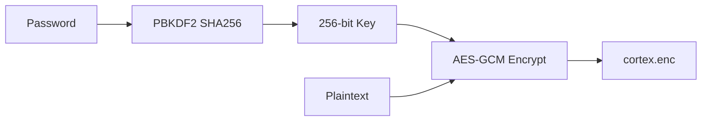

# ExoCortex - Initial App Design

## Vision

A personal "exocortex" - an encrypted, markdown-based work log that serves as a second brain. Built natively for Apple platforms (macOS + iOS) with SwiftUI.

## Core Concept

**One encrypted text file. Infinite organization through tags.**

Instead of complex folder hierarchies or specialized note-taking features, ExoCortex is deliberately simple:
- All content lives in a single encrypted log file
- Organization emerges from embedded `#tags`
- Filtering and querying extracts structure from chaos
- Biometric unlock for frictionless daily use

## Design Principles

### 1. Radical Simplicity
- No folders, no notebooks, no databases
- Just text, tags, and todos
- Learn in 2 minutes, use for years

### 2. Privacy First
- All data encrypted at rest (AES-GCM via CryptoKit)
- Password-derived key (never stored raw)
- Optional biometric unlock via Keychain + LAContext
- No cloud sync, no analytics, no tracking

### 3. Native & Fast
- Pure SwiftUI, native on macOS and iOS
- No Electron, no web views, no compromise
- Instant search and filter across entire log

### 4. Plain Text Power
- Standard Markdown format
- Human-readable even outside the app
- Future-proof - your data is yours forever

## Features

### Password Protection
```
┌─────────────────────────────────────┐
│          ExoCortex                  │
│     ┌─────────────────────┐         │
│     │ Password: ●●●●●●●●● │         │
│     └─────────────────────┘         │
│                                     │
│   [ Unlock ]  [ Use Biometrics ]    │
└─────────────────────────────────────┘
```
- First-time: password encrypts a new log file
- Subsequent: password decrypts existing log
- Incorrect password fails gracefully (no data corruption)
- Optional: store hashed password in Keychain with biometric protection

### The Log Editor
```
┌─────────────────────────────────────┐
│ Logbook                    [ Lock ] │
├─────────────────────────────────────┤
│ Filter: [#work && todo:open    ] 💾 │
├─────────────────────────────────────┤
│ 🏷️ #work  🏷️ #project  🏷️ todo:open│
├─────────────────────────────────────┤
│ ✓ Saved                             │
├─────────────────────────────────────┤
│ ## 2024-12-30 #journal              │
│                                     │
│ Starting the ExoCortex project.     │
│ Key goals:                          │
│ - [ ] Build MVP #work               │
│ - [x] Setup encryption              │
│ - [ ] Add tag filtering #feature    │
│                                     │
│ Meeting notes from standup:         │
│ Discussed timeline with team.       │
│ #meeting #work                      │
└─────────────────────────────────────┘
```

### Tag System
Tags are inline markers that create ad-hoc structure:

| Tag Type | Example | Purpose |
|----------|---------|---------|
| Topic | `#project`, `#work` | Categorize content |
| Context | `#meeting`, `#idea` | Note type |
| Status | `- [ ]`, `- [x]` | Todo tracking |
| Date | `## 2024-12-30` | Temporal organization |

### Boolean Filter Queries
```
#work                    → lines containing #work
#work && todo:open       → open todos tagged #work
#project || #research    → either tag present
!#archive               → NOT archived
(#work || #personal) && todo:open
```

**Query Parser Grammar:**
```
expression = term ( ("&&" | "||") term )*
term       = "!" term | "(" expression ")" | atom
atom       = tag | "todo:open" | "todo:done" | word
tag        = "#" word
```

### Auto-Save
- Debounced: saves 1 second after typing stops
- Visual indicator: "Saving…" → "Saved ✓"
- Never lose work due to crashes or forgetting to save

### Saved Filters
Quick access to common queries:
- `#work && todo:open` - My open work tasks
- `#meeting && @week` - This week's meetings
- `#idea` - All ideas captured

## Technical Architecture

### File Structure
```
~/Documents/cortex.enc   ← Single encrypted file
```

### Encryption Flow


**Encryption Details:**
- Key derivation: PBKDF2 with SHA256, 100,000 iterations
- Random 32-byte salt per encryption
- AES-GCM-256 with 12-byte nonce
- File format: `salt (32) | nonce (12) | ciphertext | tag (16)`

### Code Architecture
```
ExoCortex/
├── ExoCortexApp.swift      # App entry point
├── ContentView.swift       # Main navigation
├── LogView.swift           # Editor UI
├── LogViewModel.swift      # Business logic, state
├── LogRepository.swift     # File I/O
├── CryptoService.swift     # Encryption/decryption
├── KeychainService.swift   # Biometric password storage
├── TagQueryParser.swift    # Boolean filter parsing
└── SettingsView.swift      # Preferences
```

### Key Components

**LogViewModel** - The brain
- Holds all app state (`@Published` properties)
- Coordinates unlock/lock, save, filter
- Manages todo toggle, filter persistence

**CryptoService** - Security
- Pure functions: `encrypt(text, password)` → `Data`
- Handles key derivation, salt generation, AES operations
- Actor-based for thread safety

**TagQueryParser** - Search power
- Tokenizes filter input
- Shunting-yard for operator precedence
- Builds AST for efficient matching

## Data Model

### Line Item (for filtered view)
```swift
struct LineItem: Identifiable {
    let id: Int           // Line number (for todo toggle)
    let text: String      // Full line text
    let isTodo: Bool      // Contains [ ] or [x]
    let isDone: Bool      // Contains [x]
}
```

### Filter Node (AST)
```swift
enum Node {
    case tag(String)          // #tag
    case word(String)         // plain text
    case todoOpen             // todo:open
    case todoDone             // todo:done
    indirect case not(Node)   // !expr
    indirect case and(Node, Node)
    indirect case or(Node, Node)
}
```

## Platform Considerations

### macOS
- Native window management
- Keyboard shortcuts (⌘S, ⌘L for lock)
- Menu bar integration potential
- TouchBar support (future)

### iOS
- Compact layout for phone
- iPad sidebar navigation
- Face ID / Touch ID unlock
- Share sheet integration (future)

## Security Considerations

### What's Protected
- ✅ Data at rest (encrypted file)
- ✅ Memory (password cleared on lock)
- ✅ Biometric bypass (requires initial password)

### What's NOT Protected
- ⚠️ Data in memory while unlocked
- ⚠️ Screen captures
- ⚠️ Keyloggers (enter password safely)
- ⚠️ Network (no sync = no network exposure)

### Threat Model
Designed to protect against:
- Casual snooping (someone opens your laptop)
- Device theft (data unreadable without password)
- Cloud breaches (data never leaves device)

NOT designed to protect against:
- Nation-state adversaries
- Physical access while logged in
- Sophisticated malware with memory access

## Future Directions

### Near Term
- [x] LLM integration (`#p` prompts) ← Implemented!
- [ ] iCloud sync (end-to-end encrypted)
- [ ] Markdown preview mode
- [ ] Export to PDF/HTML

### Medium Term
- [ ] Multiple logs/vaults
- [ ] Full-text search indexing
- [ ] Attachments (images, files)
- [ ] Daily note templates

### Long Term
- [ ] Plugins/extensions
- [ ] Collaborative editing (shared vaults)
- [ ] Voice transcription
- [ ] Siri Shortcuts integration

## Why "ExoCortex"?

The term combines:
- **Exo-** (external) - outside your brain
- **Cortex** - the thinking part of your brain

Your ExoCortex extends your mind:
- Infinite memory (unlike biological limits)
- Instant recall (tag-based retrieval)
- Persistent thoughts (survives sleep, distraction)
- Private by design (your extended mind, your rules)

---

*"The true scarce commodity is increasingly human attention."*
— Herbert Simon

ExoCortex helps you capture, organize, and retrieve your thoughts so your attention can focus on what matters most.
